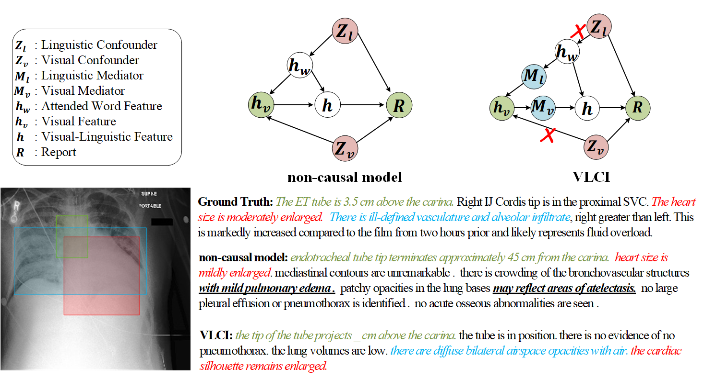

# VLCI

This is the implementation of [Cross-Modal Causal Intervention for Medical Report Generation](https://arxiv.org/pdf/2303.09117.pdf).
It contains the codes of the Visual-Linguistic Pre-training (VLP), and fine-tuning via Visual-Linguistic Causal Intervention (VLCI) on IU-Xray/MIMIC-CXR dataset.

<div align=center>



</div>

## Requirements
All the requirements are listed in the requirements.yaml file. Please use this command to create a new environment and activate it.

```
conda env create -f requirements.yaml
conda activate mrg
```


## Preparation
1. Datasets: 
You can download the dataset via `data/datadownloader.py`, or download from the repo of [R2Gen](https://github.com/cuhksz-nlp/R2Gen).
Then, unzip the files into `data/iu_xray` and `data/mimic_cxr`, respectively. 
2. Models: We provide the well-trained models of VLCI for inference, and you can download from [here](https://pan.baidu.com/s/1LKp_XLUVttAkgCHwm6QHpg?pwd=vsg1).
3. Please remember to change the path of data and models in the config file (`config/*.json`).

## Evaluation
- For VLCI on IU-Xray dataset 

```
python main.py -c config/iu_xray/vlci.json
```

<div align=center>

| Model             | B@1   | B@2   | B@3   | B@4   |C      |    R|   M  |
|:-----:            |:---:  |:---:  |:---:  |:---:  |:---:  |:---:|:---: |
| R2Gen             | 0.470 | 0.304 | 0.219 | 0.165 |/      |0.371|0.187 |
| CMCL              | 0.473 | 0.305 | 0.217 | 0.162 |/      |0.378|0.186 |
| PPKED             | 0.483 | 0.315 | 0.224 | 0.168 | 0.351 |0.376|0.190 |
| CA                | 0.492 | 0.314 | 0.222 | 0.169 |/      |0.381|0.193 |
| AlignTransformer  | 0.484 | 0.313 | 0.225 | 0.173 |/      |0.379|0.204 |
| M2TR              | 0.486 | 0.317 | 0.232 | 0.173 |/      |0.390|0.192 |
| MGSK              | 0.496 | 0.327 | 0.238 | 0.178 |0.382  |0.381|/     |
| RAMT              | 0.482 | 0.310 | 0.221 | 0.165 |/      |0.377|0.195 |
| MMTN              | 0.486 | 0.321 | 0.232 | 0.175 |0.361  |0.375|/     |
| DCL               | /     | /     | /     | 0.163 |**0.586**  |0.383|0.193 |
| VLCI              | **0.505** | **0.334** | **0.245** | **0.189** |0.456  |**0.397**|**0.204** |

</div>

- For VLCI on MIMIC-CXR dataset

```
python main.py -c config/mimic_cxr/vlci.json
```

<div align=center>

| Model             | B@1   | B@2   | B@3   | B@4   |C    |    R|   M  | CE-P  | CE-R  | CE-F1 |
|:-----:            |:---:  |:---:  |:---:  |:---:  |:---:|:---:|:---: |:---:  |:---:  |:---:  |
| R2Gen             | 0.353 | 0.218 | 0.145 | 0.103 |/    |0.277|0.142 | 0.333 | 0.273 | 0.276 |
| CMCL              | 0.334 | 0.217 | 0.140 | 0.097 |/    |0.281|0.133 | /     | /     | /     |
| PPKED             | 0.360 | 0.224 | 0.149 | 0.106 |0.237|**0.284**|0.149 | /     | /     | /     |
| CA                | 0.350 | 0.219 | 0.152 | 0.109 |/    |0.283|0.151 | 0.352 | 0.298 | 0.303 |
| AlignTransformer  | 0.378 | 0.235 | 0.156 | 0.112 |/    |0.283|0.158 | /     | /     | /     |
| M2TR              | 0.378 | 0.232 | 0.154 | 0.107 |/    |0.272|0.145 | 0.240 | 0.428 | 0.308 |
| MGSK              | 0.363 | 0.228 | 0.156 | 0.115 |0.203|**0.284**|/     | 0.458 | 0.348 | 0.371 |
| RAMT              | 0.362 | 0.229 | 0.157 | 0.113 |/    |**0.284**|0.153 | 0.380 | 0.342 | 0.335 |
| MMTN              | 0.379 | 0.238 | 0.159 | 0.116 |/    |0.283|**0.161** | /     | /     | /     |
| DCL               | /     | /     | /     | 0.109 |**0.281**|**0.284**|0.150 | 0.471 | 0.352 |0.373  |
| VLCI              | **0.400** | **0.245** | **0.165** | **0.119** | 0.190 | 0.280   |  0.150  | **0.489** | **0.340** | **0.401** |

</div>

## Citation
If you use this code for your research, please cite our paper.

```
@misc{chen2023crossmodal,
      title={Cross-Modal Causal Intervention for Medical Report Generation}, 
      author={Weixing Chen and Yang Liu and Ce Wang and Jiarui Zhu and Guanbin Li and Liang Lin},
      year={2023},
      eprint={2303.09117},
      archivePrefix={arXiv},
      primaryClass={cs.CV}
}
```

## Contact
If you have any question about this code, feel free to reach me (chen867820261@gmail.com)

## Acknowledges
We thank [R2Gen](https://github.com/cuhksz-nlp/R2Gen) for their open source works.